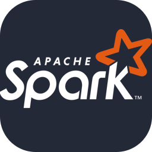

# Gutemberg Santos
##  🙄 About me !

Hello, you can call me Guto! I like working with data and transforming it into information for decision making. I think it's really cool when we take data from various places and transform it into valuable information. Known as ETL, it is the methodology that I master most, using tools such as Hadoop, Pyspark, SQL, etc. And the cool thing is that today we can do this in the cloud! And why not help analyze this data? I can help with that too! So let's continue with this challenge!

## 💻 Technical Skills

## 📧 Contact

  

